<p align="center">
  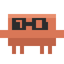
</p>

<p align="center"><em>clawd has infiltrated my computer</em></p>

<p align="center">
  
  
  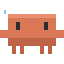
  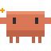
  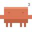
</p>

<h1 align="center">oh-my-clawd</h1>

<p align="center">
  <strong>A status line + menu bar Tamagotchi for Claude Code</strong>
</p>

<p align="center">
  English · <a href="README.md">한국어</a>
</p>

<p align="center">
  <a href="https://github.com/Hoya324/oh-my-clawd/releases/latest/download/OhMyClawd.dmg"></a>
  
  = 18" />
  
</p>

---

## Preview

```
[HUD] | 5h:14%(3h51m) | wk:62%(3d5h) | session:29m | ctx:39% | 53 | agents:2 | opus-4-6
```

## Installation

### DMG Download (Recommended)

Download the `.dmg` file from the [latest release page](https://github.com/Hoya324/oh-my-clawd/releases/latest/download/OhMyClawd.dmg) and install.

### Manual Install

```bash
git clone https://github.com/Hoya324/oh-my-clawd.git ~/.oh-my-clawd
~/.oh-my-clawd/install.sh
```

Then **restart Claude Code**.

## HUD Status Line

| Segment | Description | Color Logic |
|---------|-------------|-------------|
| `5h:14%` | 5-hour rate limit usage | Green < 70% < Yellow < 90% < Red |
| `(3h51m)` | Time until 5h limit resets | Dim |
| `wk:62%` | Weekly rate limit usage | Same as above |
| `session:29m` | Current session duration | Green < 30m < Yellow < 60m < Red |
| `ctx:39%` | Context window usage | Green < 70% < Yellow < 85% < Red |
| `53` | Total tool calls in session | -- |
| `agents:2` | Currently running agents | Cyan |
| `opus-4-6` | Active model | Dim |

## Clawd — Menu Bar Companion

A Tamagotchi-style 32x32 pixel art character that lives in your macOS menu bar.
**Clawd** (#D97757), the official Claude Code mascot, reacts to your Claude Code activity in real time.

> 8 States | 3 Activity Levels | 14 Accessories | 10 Body Colors

### Clawd States

| State | | Description | Trigger |
|-------|-|-------------|---------|
| Sleeping |  | Eyes closed, Zzz | No active sessions |
| Waking up | 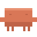 | Jumps awake | idle→active transition |
| Walking |  | Walking happily | Default active state |
| Working hard |  | Fast movement | 50+ tool calls |
| Bloated | 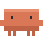 | Puffed up, slow | Context >= 70% |
| Stressed |  | Shaking, alert | Rate limit >= 80% |
| Tired |  | Droopy eyes | Session >= 45 min |
| Collab |  | Multi-agent anim | 2+ agents |

### Activity Levels

Clawd's activity level changes based on concurrent agent count.

| Level | Condition | Description |
|-------|-----------|-------------|
| Normal | 0-1 agents | Default appearance |
| Glowing | 2-3 agents | Glowing effect |
| Supercharged! | 4+ agents | Maximum energy |

### Accessory Collection (14 Accessories)

Unlock accessories for Clawd based on your Claude Code usage milestones.
Mix and match hats, glasses, and pants to create your own unique Clawd style!

#### Hats (5)

| Accessory | | Unlock Condition |
|-----------|--|-----------------|
| Cap | 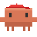 | 10 sessions |
| Party Hat |  | 5 hours total usage |
| Santa Hat |  | 500K tokens used |
| Silk Hat |  | 50 agent runs |
| Cowboy Hat | 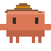 | 30 hours total usage |

#### Glasses (4)

| Accessory | | Unlock Condition |
|-----------|--|-----------------|
| Horn-rimmed |  | 3+ concurrent sessions |
| Sunglasses | 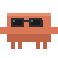 | 10 rate limit hits |
| Round Glasses | 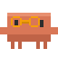 | 20 long sessions (45m+) |
| Star Glasses | 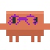 | 10 hours on Opus |

#### Pants (5)

| Accessory | | Unlock Condition |
|-----------|--|-----------------|
| Jeans | 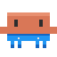 | 15 hours total usage |
| Shorts | 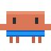 | 100 sessions |
| Slacks | 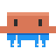 | 1M tokens used |
| Joggers | 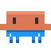 | 100 agent runs |
| Cargo Pants | 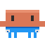 | 50 hours total usage |

### Clawd Fashion Show

Mix and match hats + glasses + pants to create your own unique style.

<p align="center">
  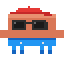
  
  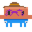
  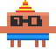
  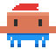
  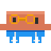
  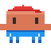
</p>

<p align="center">
  <sub>Casual · Gentleman · Cowboy · Party · Santa · Nerd · Sporty</sub>
</p>

> With **5 hats x 4 glasses x 5 pants = 100+** possible combinations (even more if you include no-accessory slots!)

### Body Color Change

Use color gacha tickets to change Clawd's body color. 10 colors available, picked at random!

| Color | Name |
|-------|------|
| 🟤 Terracotta | Default |
| 🔵 Blue | Blue |
| 🔴 Red | Red |
| 🟢 Green | Green |
| 🟣 Purple | Purple |
| 🟡 Gold | Gold |
| 🩷 Pink | Pink |
| 🔷 Navy | Navy |
| 🟩 Mint | Mint |
| 🟠 Coral | Coral |

## Updates

Click the **Check for Updates** button in the menu bar popover to check for the latest version on GitHub Releases. If a new version is available, it will open the download page.

## Requirements

- **macOS 13.0+**
- **Node.js >= 18**
- **Claude Code** with OAuth login (for rate limit data)

## Uninstall

```bash
~/.oh-my-clawd/install.sh remove
rm -rf ~/.oh-my-clawd
```

If you installed the oh-my-clawd app separately:

```bash
~/.oh-my-clawd/pet/install.sh remove
```

## License

MIT

---

This project is licensed under the MIT License. However, the Clawd character design is copyrighted by [Anthropic](https://anthropic.com). This is a non-commercial fan project and cannot be used for commercial purposes — nor do we have any intention to. If any copyright issues arise, we will remove it immediately. Please have mercy.
