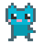
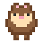
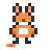
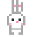
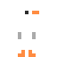
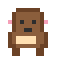
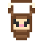
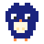
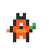
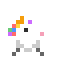

<p align="center">
  
</p>

<h1 align="center">Claude HUD</h1>

<p align="center">
  <strong>A status line + menu bar pet for Claude Code</strong>
</p>

<p align="center">
  English · <a href="README.md">한국어</a>
</p>

<p align="center">
  <a href="https://github.com/Hoya324/claude-hud/releases/latest/download/ClaudeHud.dmg"></a>
  
  = 18" />
  
</p>

---

## Preview

```
[HUD] | 5h:14%(3h51m) | wk:62%(3d5h) | session:29m | ctx:39% | 53 | agents:2 | opus-4-6
```

## Installation

### DMG Download (Recommended)

Download the `.dmg` file from the [latest release page](https://github.com/Hoya324/claude-hud/releases/latest/download/ClaudeHud.dmg) and install.

### Manual Install

```bash
git clone https://github.com/Hoya324/claude-hud.git ~/.claude-hud
~/.claude-hud/install.sh
```

Then **restart Claude Code**.

## HUD Status Line

| Segment | Description | Color Logic |
|---------|-------------|-------------|
| `5h:14%` | 5-hour rate limit usage | Green < 70% < Yellow < 90% < Red |
| `(3h51m)` | Time until 5h limit resets | Dim |
| `wk:62%` | Weekly rate limit usage | Same as above |
| `session:29m` | Current session duration | Green < 30m < Yellow < 60m < Red |
| `ctx:39%` | Context window usage | Green < 70% < Yellow < 85% < Red |
| `53` | Total tool calls in session | -- |
| `agents:2` | Currently running agents | Cyan |
| `opus-4-6` | Active model | Dim |

## Claude Pet -- Menu Bar Companion

A Tamagotchi-style pixel art pet that lives in your macOS menu bar. It reacts to Claude Code activity, and you can collect 12 unique pets and grow their muscle stages.

### Pet States

| State | Trigger | Behavior |
|-------|---------|----------|
| Sleeping | No active sessions | Curled up with Zzz |
| Walking | Normal usage | Walk cycle animation |
| Running | 50+ tool calls | Fast run with sweat drops |
| Bloated | Context >= 70% | Puffy round body |
| Stressed | Rate limit >= 80% | Shaking with "!" |
| Tired | Session > 45 min | Slouched, droopy eyes |
| Collab | 2+ agents | Team walking |

### Muscle Stages

Your pet grows based on concurrent agent count.

| Stage | Condition | Effect |
|-------|-----------|--------|
| Normal | 0-1 agents | Standard size |
| Buff | 2-3 agents | Wider shoulders, defined muscles |
| Macho | 4+ agents | Absurdly huge body, tiny head, gold sparkles |

### Pet Collection (12 Pets)

<p>
  
  
  
  
  
  
  
  
  
  
  
  
</p>

| Pet | Unlock Condition |
|-----|-----------------|
| Cat | Default pet |
| Hamster | 10 total sessions |
| Chick | 5 hours total usage |
| Penguin | 500K tokens used |
| Fox | 50 agent runs |
| Rabbit | 3+ concurrent sessions |
| Goose | 30 hours total usage |
| Capybara | 10 rate limit hits |
| Sloth | 20 long sessions (45m+) |
| Owl | 10 hours on Opus |
| Dragon | 5+ concurrent agents |
| Unicorn | Unlock all other pets |

## Updates

Click the **Check for Updates** button in the menu bar popover to check for the latest version on GitHub Releases. If a new version is available, it will open the download page.

## Requirements

- **macOS 13.0+**
- **Node.js >= 18**
- **Claude Code** with OAuth login (for rate limit data)

## Uninstall

```bash
~/.claude-hud/install.sh remove
rm -rf ~/.claude-hud
```

If you installed the pet app separately:

```bash
~/.claude-hud/pet/install.sh remove
```

## License

MIT
