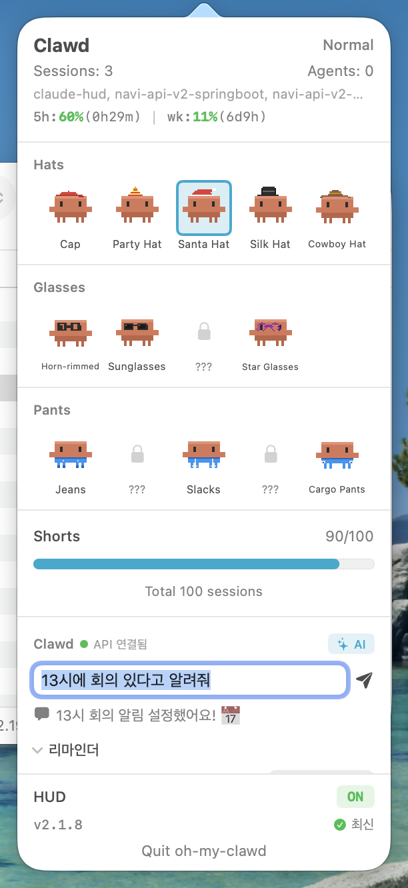
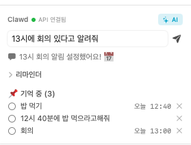
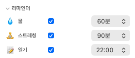
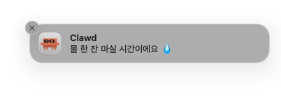
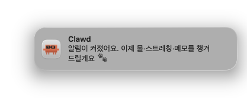

<p align="center">
  
</p>

<p align="center"><em>내 컴퓨터에 침투한 clawd</em></p>

<p align="center">
  
  
  
  
  
  
  
  
  
</p>

<h1 align="center">oh-my-clawd</h1>

<p align="center">
  <strong>Claude Code를 위한 상태 표시줄 + 메뉴바 다마고치</strong>
</p>

<p align="center">
  <a href="README.md">English</a> · 한국어
</p>

<p align="center">
  <a href="https://github.com/Hoya324/oh-my-clawd/releases/latest/download/OhMyClawd.dmg"></a>
  
  = 18" />
  
</p>

---

## 미리보기

```
[HUD] | 5h:14%(3h51m) | wk:62%(3d5h) | session:29m | ctx:39% | 53 | agents:2 | opus-4-6
```


## 설치

### DMG 다운로드 (권장)

[최신 릴리스 페이지](https://github.com/Hoya324/oh-my-clawd/releases/latest/download/OhMyClawd.dmg)에서 `.dmg` 파일을 다운로드하여 설치합니다.

### 수동 설치

```bash
git clone https://github.com/Hoya324/oh-my-clawd.git ~/.oh-my-clawd
~/.oh-my-clawd/install.sh
```

설치 후 **Claude Code를 재시작**하세요.

## HUD 상태 표시줄

| 세그먼트 | 설명 | 색상 로직 |
|----------|------|-----------|
| `5h:14%` | 5시간 요청 한도 사용률 | 초록 < 70% < 노랑 < 90% < 빨강 |
| `(3h51m)` | 5시간 한도 초기화까지 남은 시간 | 흐린색 |
| `wk:62%` | 주간 요청 한도 사용률 | 위와 동일 |
| `session:29m` | 현재 세션 지속 시간 | 초록 < 30분 < 노랑 < 60분 < 빨강 |
| `ctx:39%` | 컨텍스트 윈도우 사용률 | 초록 < 70% < 노랑 < 85% < 빨강 |
| `53` | 세션 내 총 도구 호출 횟수 | -- |
| `agents:2` | 현재 실행 중인 에이전트 수 | 청록색 |
| `opus-4-6` | 활성 모델 | 흐린색 |

## Clawd — 메뉴바 동반자

macOS 메뉴바에 상주하는 다마고치 스타일의 32x32 픽셀아트 캐릭터입니다.
Claude Code의 공식 마스코트인 **Clawd**(#D97757)가 Claude Code 활동에 실시간으로 반응합니다.

> 8가지 상태 | 3단계 활동 레벨 | 14종 액세서리 | Claude 기반 Companion

### Clawd 상태

| 상태 | | 한국어 | 조건 |
|------|--|--------|------|
| Sleeping |  | 자고 있어요... | 활성 세션 없음 |
| Waking up |  | 깨어나는 중! | idle→active 전환 |
| Walking |  | 신나게 걷는 중 | 기본 활성 상태 |
| Working hard |  | 열심히 일하는 중! | 도구 호출 50회 이상 |
| Bloated |  | 컨텍스트가 가득... | 컨텍스트 70% 이상 |
| Stressed |  | 레이트 리밋 경고! | 요청 한도 80% 이상 |
| Tired |  | 피곤해요... | 45분 이상 세션 |
| Collab |  | 함께 일하는 중! | 에이전트 2개 이상 |

### 활동 레벨

동시 실행 에이전트 수에 따라 Clawd의 활동 레벨이 달라집니다.

| 레벨 | 조건 | 설명 |
|------|------|------|
| Normal (보통) | 에이전트 0-1개 | 기본 상태 |
| Glowing (빛나는 중) | 에이전트 2-3개 | 발광 효과 |
| Supercharged! (슈퍼차지!) | 에이전트 4개 이상 | 최대 에너지 |

### 액세서리 컬렉션 (14종)

Claude Code 사용 실적에 따라 Clawd에게 착용시킬 액세서리를 해금할 수 있습니다.
모자, 안경, 바지를 자유롭게 조합하여 나만의 Clawd를 꾸며보세요!

#### 모자 (5종)

| 액세서리 | | 해금 조건 |
|----------|--|-----------|
| 캡모자 (Cap) |  | 세션 10회 |
| 꼬깔모자 (Party Hat) |  | 총 사용 시간 5시간 |
| 산타모자 (Santa Hat) |  | 토큰 50만 사용 |
| 실크햇 (Silk Hat) |  | 에이전트 실행 50회 |
| 카우보이모자 (Cowboy Hat) |  | 총 사용 시간 30시간 |

#### 안경 (4종)

| 액세서리 | | 해금 조건 |
|----------|--|-----------|
| 뿔테안경 (Horn-rimmed) |  | 동시 세션 3개 이상 |
| 선글라스 (Sunglasses) |  | 요청 한도 도달 10회 |
| 둥근안경 (Round Glasses) |  | 긴 세션(45분+) 20회 |
| 별안경 (Star Glasses) |  | Opus 모델 사용 10시간 |

#### 바지 (5종)

| 액세서리 | | 해금 조건 |
|----------|--|-----------|
| 청바지 (Jeans) |  | 총 사용 시간 15시간 |
| 반바지 (Shorts) |  | 세션 100회 |
| 정장바지 (Slacks) |  | 토큰 100만 사용 |
| 운동바지 (Joggers) |  | 에이전트 실행 100회 |
| 카고바지 (Cargo Pants) |  | 총 사용 시간 50시간 |

### Clawd 패션쇼

모자 + 안경 + 바지를 자유롭게 조합하면 나만의 스타일이 완성됩니다.

<p align="center">
  
  
  
  
  
  
  
</p>

<p align="center">
  <sub>캐주얼 · 젠틀맨 · 카우보이 · 파티 · 산타 · 너드 · 스포티</sub>
</p>

> 총 **5 x 4 x 5 = 100가지** 이상의 조합이 가능합니다. (미착용 포함 시 더 많아요!)

## Clawd Companion

Clawd는 단순한 장식이 아니라, Claude Haiku 기반의 가벼운 데일리 어시스턴트입니다. 자연어로 입력하면 시간을 해석해 메모로 저장하거나, 리마인더를 켜고 끄거나, 그냥 대화도 해줘요.

<p align="center">
  
</p>

### 자연어 메모 + 리마인더

한국어/영어 자연어 그대로 말하면 Clawd가 시각을 해석해서 메모에 `dueAt`을 붙이고, 해당 시각에 macOS 알림을 발화합니다.

<p align="center">
  
</p>

- `3시에 회의 있다고 알려줘` → `dueAt: 15:00` 메모, 3시에 알림
- `12시 40분에 밥 먹으라고` → `dueAt: 12:40` 메모
- `오늘 뭐 기억해둔 거 있어?` → 열린 메모를 답변으로만 알려줌
- `스트레칭 알림 2시간마다` → 스트레칭 리마인더 120분으로 전환

### 스케줄 리마인더

세 가지 기본 습관 알림. 각각 on/off + 간격 조절 가능.

<p align="center">
  
</p>

| 종류 | 기본 주기 | 발화 조건 |
|------|-----------|-----------|
| 💧 물 | 60분마다 | Claude 세션 활성 시 |
| 🧘 스트레칭 | 90분마다 | Claude 세션 활성 시 |
| 📝 일기 | 매일 22:00 | 오늘 Claude 사용 기록 있을 때 |

네이티브 macOS 알림으로 발화, 종류별 쿨다운, 설정은 `~/.claude/pet/clawd-memory.json`에 영속 저장됩니다.

<p align="center">
  
  
</p>

### 메모 전용 모드 (AI 안 쓰기)

간단한 기록에 쿼터 쓰기 싫을 때는 Clawd 헤더의 `✨ AI` 칩을 탭하세요. `✏️ 메모`로 바뀝니다. 이 모드에서 입력한 텍스트는 **즉시** 생 메모로 저장됩니다 — LLM 호출 없음, 네트워크 없음, 토큰 소비 0. 다시 탭하면 AI 모드로 복귀.

- **AI 모드**: 자연어 시간 해석(`"3시에 ..."`), 리마인더 등록, 대화
- **메모 모드**: 빠른 기록(`"보일러 점검"`, `"장봐야함"`)

### 동작 방식

- **Anthropic API 직접 호출**. Claude Code OAuth 토큰을 macOS 키체인에서 읽어서 씁니다. 왕복 0.5~2초, API 플랜 과금 없음 — `claude -p`와 동일하게 Claude 구독 rate limit에서 차감됩니다.
- **Fallback**: 키체인 경로 실패 시 로컬 `claude` CLI를 subprocess로 실행.
- **웹 질문** (날씨, 기사, 사실 질의) 은 Claude 내장 WebFetch / WebSearch로 자동 처리. 별도 설정 없음.

## 업데이트

**앱 내 자동 설치.** 런치 후 몇 초 뒤 GitHub에 신버전을 확인합니다. 업데이트가 있으면 팝오버 하단에 `v<현재> → v<신규> 설치` 버튼이 표시됩니다. 클릭하면 Clawd가 DMG를 다운로드해서 자기 자신을 덮어쓰고 재시작합니다. 브라우저 필요 없음.

`최신` 라벨을 클릭하면 수동으로 다시 확인합니다.

## 요구사항

- **macOS 13.0+**
- **Node.js >= 18**
- **Claude Code** OAuth 로그인 (요청 한도 데이터 조회용)

## 제거

```bash
~/.oh-my-clawd/install.sh remove
rm -rf ~/.oh-my-clawd
```

oh-my-clawd 앱을 별도로 설치한 경우:

```bash
~/.oh-my-clawd/pet/install.sh remove
```

## 라이선스

MIT

---

이 프로젝트는 MIT 라이센스를 따릅니다. 단, Clawd 캐릭터 디자인의 저작권은 [Anthropic](https://anthropic.com)에 있습니다. 본 프로젝트는 비상업적 팬 프로젝트이며, 상업적 용도로 사용할 수 없고, 사용할 생각도 없습니다. 저작권 관련 문제가 발생할 경우 즉시 삭제하겠습니다. 살려주세요.
